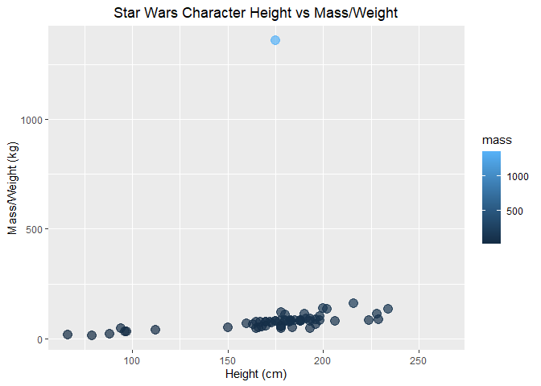
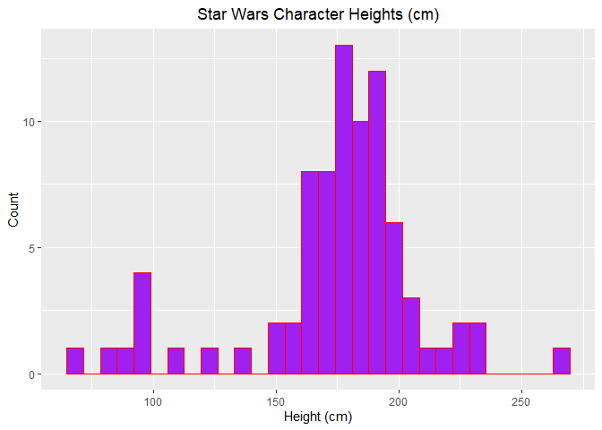

<!-- -->


```r
# histogram of character heights
ggplot(data = starwars, aes(x = height)) +
  geom_histogram(color = "red", fill = "purple")+
  xlab('Height (cm)')+
  ylab('Count')+
  ggtitle("Star Wars Character Heights (cm)")+
  theme(plot.title = element_text(hjust = 0.5))
```

<!-- -->


```r
# mean median, variance, and standard deviation (drop NA values)

sw_height_mean <- mean(starwars$height,na.rm = TRUE)

sw_height_median <- median(starwars$height,na.rm = TRUE)

sw_height_variance <- var(starwars$height,na.rm = TRUE)

sw_height_sd <- sd(starwars$height,na.rm = TRUE)
```

There is a mean height of **174.4** centimeters in the characters of star wars dataframe
